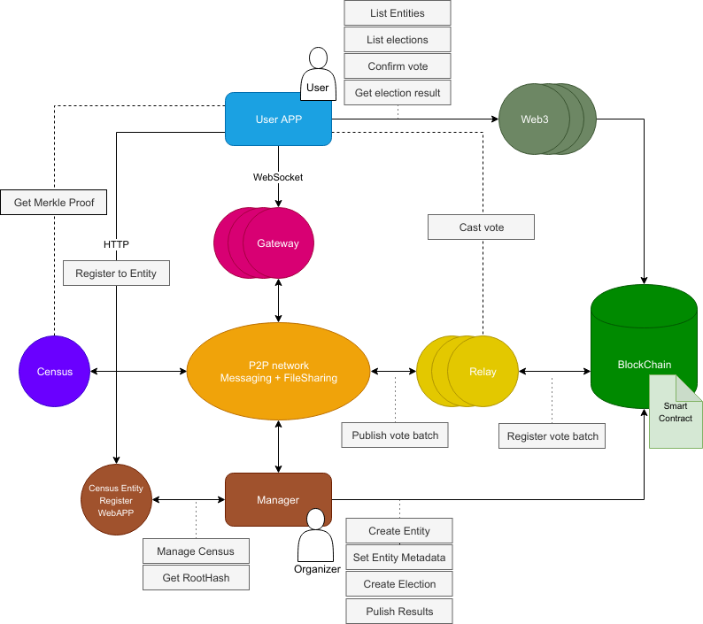

# Global architecture

## Service architecture and components

To avoid censorship and to provide resilence, the network architecture should accomplish the following requirements:

+ Do not rely on DNS
+ Do not depend on specific IPs
+ Do not depend on any specific company or cloud infrastructure
+ Do use P2P network connections when possible
+ Do use static web pages, so they can be replicated
+ Do allow third parties to add infrastructure

To this end, the Vocdoni platform is composed of the following components.

+ The data integrity is provided by a public BlockChain such as Ethereum main net.

+ The data availability is provided by a distributed filesystem such as Swarm or IPFS.

+ The messaging protocol is provided by a distributed message protocol such as Whisper, IPFS/PubSub or Swarm/PSS.

+ The client interface (app or webapp) interacts with the P2P network and blockchain through one or multiple gateways (using WebSockets or HTTP/RPC). These gateways are neutral/agnostic, so any can be used. All cryptography and/or or security should be done client side, such that the only function of the gateways is to forward information.

## Components

### Relay

The relay pool is a group of nodes which are responsible for handling votes, verifying their validity, publishing them to the BlockChain and keeping their data pinned on the P2P filesystem.

### Gateway/Web3
Gateways provide an entry point to the P2P network. They allow clients to reach decentralized services (census, relays, etc.) through a WebSocket or an HTTP interface.

### Census Service
A server handling the public census of an Entity. It stores Merkle trees with user claims, it allows the organizer to trigger updates (using asymmetric key signature authentication) and allows clients to ask for data on a particular Merkle tree.

The Census Service is a critical piece of the overall platform, so its real IP/location should be hidden as much as possible. Ideally, it should only be reachable through the P2P messaging protocol.

### Census Registry
A web site provided by the Entity typically used to validate a user before adding him/her to a Census. This web site is loaded on a webview from the client app, once the user decides to register to an Entity. The required steps to pass a validation are dependent on every Entity and need a custom integration.

### Census Manager
A private server allowing Entity administrators to manage the attributes (age, payment status, etc.) of users registered to it. Data from this service typically lives on a private database that will produce updated versions of specific census on demand.

The web site also allows to create new census and define the requirements that users have to accomplish to be included.

### Process Manager
A private server providing the Entity administrators a web site to manage voting processes on the blockchain. 

### Client app
Any mobile app or web site with access to Web3 libraries and cryptographic primitives to compute signatures and blockchain transactions.

### Blockchain
An Ethereum blockchain capable of mining transactions.

### Scrutinizer
Any participant on the system can fetch the scrutiny script and compute the voting process results on his/her own.

## Client
`The current contents are a work in progress`

#### dvote-client
`The current contents are a work in progress`

#### Web runtime (for React Native)
`The current contents are a work in progress`

## Relay
`The current contents are a work in progress`

#### Snarks validator
`The current contents are a work in progress`

#### go-dvote
`The current contents are a work in progress`

## Process Manager Service
`The current contents are a work in progress`
## Census Service
`The current contents are a work in progress`
## Blockchain
`The current contents are a work in progress`

#### dvote-smart-contracts
`The current contents are a work in progress`

## IPFS/Swarm
`The current contents are a work in progress`

---

This page is a work in progress.
